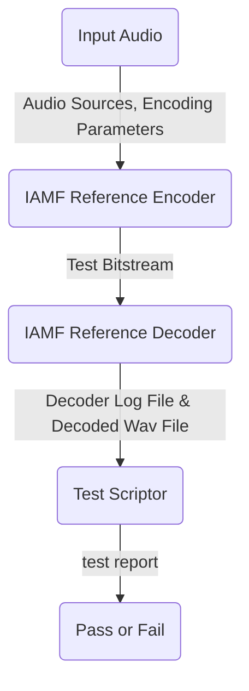

# Primitive Test

1. Test Number: test_000000

2. Test Item: OBU Syntax verification based on LPCM stereo

3. Test Methodology
- IAMF Reference Encoder generates test bitstream (test_000000_x.iamf)
- IAMF Reference Decoder outputs decoder log file (test_000000_x.log) and decoded wav file (ss0_test_000000_x.wav)
- Test script file (test_000000.py) checks decoder log file

4. Test Bitstream
- test_000000_1.zip: test_000000_1.wav, test_000000_1.iamf, test_000000_1_metadata.txt
- test_000000_3.zip: test_000000_3.wav, test_000000_3.iamf, test_000000_3_metadata.txt

5. Executing Examples
- (base) python test_000000.py --log test_000000_1.log --wav ss0_test_000000_1.wav
> 259 item(s) of test_000000_1.log is(are) passed.

- (base) python test_000000.py --log test_000000_3.log --wav ss0_test_000000_3.wav
> failure line is #35.

