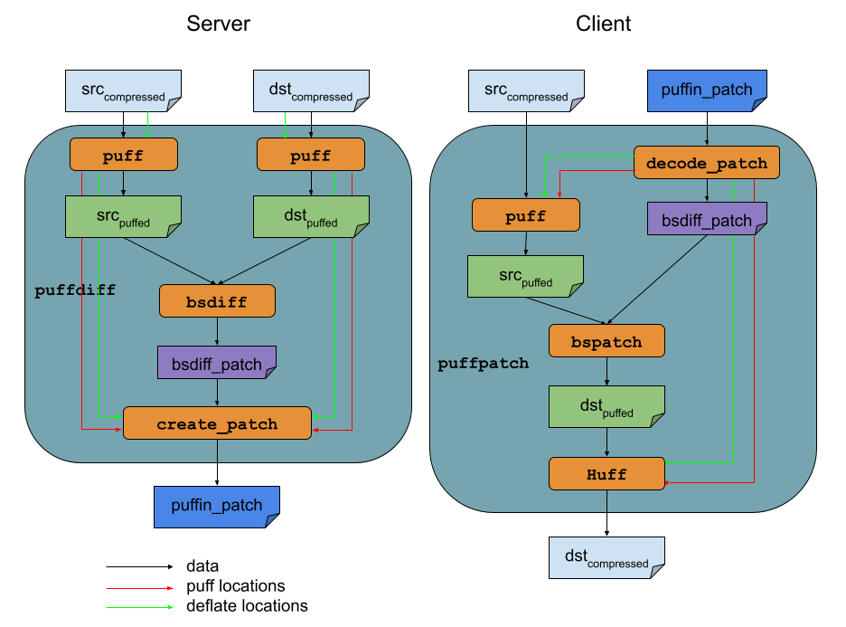

# Puffin: A deterministic deflate re-compressor (for patching purposes)

## Table of Contents

[TOC]

## Puffin

Puffin is a deterministic deflate recompressor. It is mainly used for patching
deflate compressed images (zip, gzip, etc.) because patches created from deflate
files/streams are usually large (deflate has a bit-aligned format, hence,
changing one byte in the raw data can cause the entire deflate stream to change
drastically.)

Puffin has two tools (operations): `puffdiff` and `puffpatch` (shown
[here](puffin).)  The purpose of `puffdiff` operation is to create a patch
between a source and a target file with one or both of them having some deflate
streams. This patch is used in the `puffpatch` operation to generate the target
file from the source file deterministically. The patch itself is created by
`bsdiff` library (but can be replaced by any other diffing mechanism). But,
before it uses `bsdiff` to create the patch, we have to transform both the
source and target files into a specific format so `bsdiff` can produce smaller
patches. We define `puff` operation to perform such a transformation. The
resulting stream is called a `puff` stream. The reverse transformation (from
`puff` stream to deflate stream) is called a `huff` operation. `huff` is used in
the client to transform the `puff` stream back into its original deflate stream
deterministically.



For information about deflate format see [RFC 1951].

## puff and huff

`puff` is an operation that decompresses only the Huffman part of the deflate
stream and keeps the structure of the LZ77 coding unchanged. This is roughly
equivalent of decompressing ‘half way’.

`huff` is the exact opposite of `puff` and it deterministically converts the
`puff` stream back to its original deflate stream. This deterministic conversion
is based on two facts:

*   There is no need to perform LZ77 algorithm. This means the deflate stream
    could be built by any LZ77 algorithm.
*   The dynamic Huffman tables can be recreated uniquely from the code length
    array stored inside the `puff` stream. This means the deflate stream can be
    reconstructed deterministically using the Huffman tables.

The inclusion of Huffman tables in the `puff` stream has minuscule space burden
(on average maximum 320 bytes for each block. There is roughly one block per
32KB of uncompressed data).

`bsdiff` of two `puffed` streams has much smaller patch in comparison to their
deflate streams, but it is larger than uncompressed streams.

**The major benefits**

*   Size of the patch is smaller than deflate stream’s patch.
*   `puff` and `huff` are deterministic operations.
*   `huff` is in order of 10X faster than full recompression. It is even faster
    than Huffman algorithm because it already has the Huffman tables and does
    not need to reconstruct it.
*   Both algorithms have very low memory footprint.
*   The underlying LZ77 algorithm can be anything (as long as it is deflate
    compatible). This includes google’s [zopfli]

**The drawbacks**

*   The need to define a file format for the puffed stream and stay with this
    format forever. If format needs to be changed in the future, then some
    versioning mechanism should be there to handle it and backward compatibility
    should be maintained.
*   The need to define a payload format and stay with it forever. Similarly
    needs to be versioned if required later change.
*   Does not reduces the patch size as full recompression.


## puffdiff and puffpatch

A deflate compressed file (gzip, zip, etc.) contains multiple deflate streams at
different locations. When this file is puffed, the resulting `puff` stream
contains both puffs and the raw data that existed between the deflates in the
compressed file. When performing `huff` operation, the location of puffs in the
`puff` stream and deflates in the deflate stream should be passed upon. This is
necessary as `huff` operation has to know exactly where the locations of both
puffs and deflates are. (See the following [image](puffin-stream))


Similarly `puffpatch` requires deflates and puffs locations in both the source
and target streams. These location information is saved using Protobufs in the
patch generated by `bsdiff`. One requirement for these two operations are that
`puffpatch` has to be efficient in the client. Client devices have limited
memory and CPU bandwidth and it is necessary that each of these operations are
performed with the most efficiency available. In order to achieve this
efficiency a new operation can be added to `bspatch`, that reads and writes into
a `puff` streams using special interfaces for puffing and huffing on the fly.


## Puffin Patch Format

*   Magic (4 bytes) - The string literal "PUF1".
*   Header Length (4 bytes) - The size of the header (length of the generated
    Protobuf).
*   Header - Lengths and locations of deflate and puffs streams in source and
    target files in a Protobuf format. See [puffin.proto].
*   Patch - This is a binary array directly generated by the `bsdiff` program.

## Puffin Stream Format

*   [Block Header](#block-header-format) (3+ bytes) - Defines the type of the
    block.
*   Data - A mix of literals list and copy length/distances.
*   End of Block (2 bytes) - The end of block symbol. Similar to the symbols for
    copy length/distance but without the distance bytes. The actual copy length
    value is 259 (0x81FF).

### Block Header Format

*   Length (2 Bytes) - The size of the block header excluding the two Length
    bytes itself - 1.
*   Final Block (1 Bit) - Whether the block is the last one or not.
    *   1 - Final block
	*   0 - Middle block
*   Type (2 Bits)
    *   0 - Uncompressed. Immediately after the header, zero or one literals
        list is present which defines the content of the uncompressed blocks.
	*   1 - Fixed Huffman table. The list of literals and length/distances comes
        immediately after the header. Fixed Huffman table is defined the deflate
        specification and will not change.
	*   2 - Dynamic Huffman table. The dynamic Huffman table comes at the end of
        the block header.
	*   3 - Undefined. This is an error.
*   Skip Bits (5 Bits) - Used only for uncompressed blocks (For other types its
    value is zero). In an uncompressed block, the [RFC 1951] skips any bits
    after reading final block and type bits until the byte boundary in the
    input. However, it does not define what the value of these bits should
    be. Most implementations assume 0, but some implementations may use any
    value. This segment contains those bits as a five-bits integer. When writing
    the block header back to the deflate format, the actual number of bits which
    where skipped will be calculated easily.
*   Huffman Table - It only comes for dynamic Huffman table.

#### Dynamic Huffman Table Format

Depending on the scheme for storing the Huffman tables, the payload size can
change. We discovered that the following scheme does not produce the smallest
payload, but it is the most deterministic one. In a deflate stream, Huffman
tables for literals/length and distances are themselves Huffman coded. In this
format, we also `puff` the Huffman tables into the `puff` stream instead of
completely decompressing them.

There are three tables stored in this structure very similar to the one defined
in [RFC 1951].  A Huffman table can be defined as an array of unsigned integer
code length values. Three Puffed Huffman tables appear like the following
scheme. The first table (codes) is the Huffman table used to decode the next two
Huffman tables. The second Huffman table is used to decode literals and lengths,
and the third Huffman table is used to decode distances.


*   Literal/Length Count (1 byte) - Number of alphabets used for literal/length
    Huffman codes - 257.
*   Distance Count (1 byte) - Number of alphabets used for distance Huffman
    codes - 1.
*   Alphabet Count (1 byte) - Number of alphabets for coding two previous
    Huffman tables - 4.
*   Code Lengths ((Alphabet Count + 1) / 2 bytes) - A list of codes for reading
    the next two Huffman tables. Each byte contains two codes. If the number of
    codes is odd, the last four Bits will be zero.
*   Literal/Length/Distance Code Lengths - List of code lengths for encoding
    literals/lengths/distance followed The encoding is as follows:
	*   [0..15] - Represent code [0..15]
	*   [16..19] - Copy the last code length [3..6] times.
	*   [20..27] - Repeat code length of 0 for [3..10] times.
	*   [28..155] - Repeat code length of 0 for [11..138] times.

### Literals List
Literals lists are constructed by a “length” value followed by “length” bytes of
literals. The Puffer should try to merge adjacent literals lists as much as
possible into one literals list in the `puff` stream.  This Is a length value
followed by length bytes of literals (Even if there is only one literal.)

*   Tag (1 Bit) - The value is 0 indicating that this is a list of literals (not
    a copy length/distance).
*   Length - The number of literals that would follow in the list.
    *   (7 Bits) Length = [1 .. 127], The value is: Length - 1
	*   (7 Bits + 2 Bytes) Length = [128 .. 65663], The values are: 127,
        Length - 127.
	Conserves size by using only one byte if the number of upcoming
    literals is smaller or equal to 127 (About 99% of literals length in a
    normal deflate stream fit into this category.) We should never have zero
    length literals. Otherwise it will use three bytes.
*   Literals (Length Bytes) - A sequence of Length number of literals.

### Copy Length/Distance

This Is a Length value followed by a Distance value.

*   Tag (1 Bit) - The value is 1 indicating that this is a copy length/distance
    field.
*   Length - Conserves size by using only one byte if the length value is
    smaller or equal to 129. Otherwise two bytes are used.
    *   (7 Bits) - Length = [3 .. 129], The value is: Length - 3
	*   (7 Bites + 1 Byte) Length = [130 .. 258], The value is: 127, Length -
        130:
*   Distance (2 Bytes) - Distance = [1 .. 32768], The value is:
    Distance - 1. The distance value as an unsigned integer.

## Building Puffin
Currently Puffin is being used in both Android and Chrome OS and is built
differently in each of them. There is also a Makefile build, but it is not
comprehensive.

## Usage

Puffin builds an executable `puffin` which can be used to perform diffing and
patching algorithms using Puffin format. To get the list of options available
run:

```shell
puffin --help
```

It can also be used as a library (currently used by update_engine) that provides
different APIs.

## Compute Patch
To compute the diff between our current state and the original changes:
`git diff 4180a65119ef2c333c4d33c9e39869da89a8faea -- .`

## References

[RFC 1951]: https://www.ietf.org/rfc/rfc1951.txt
[puffin.proto]: /src/puffin.proto
[zopfli]: https://en.wikipedia.org/wiki/Zopfli
