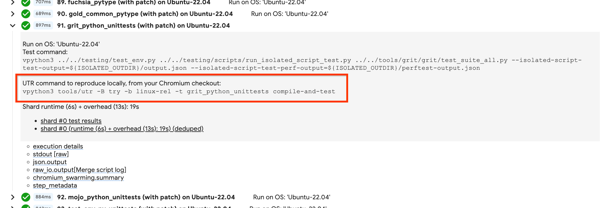

# UTR - The Universal Test Runner

UTR is a tool that can locally compile and/or run tests the same way it's done
on the bots. At its heart, it wraps the same codebase used by the bots to drive
their builds, while bypassing parts that don't make sense for developer's
machines. This abstracts away pesky details that are hard to remember or
discover on bots like:
- GN args that may or may not prevent local reproduction
- Full command line args for a test invocation
- Precise OS version to target for remote tests

With this tool, all such details will automatically use what the given builder
uses. It also bypasses Gerrit entirely, avoiding the need to upload patchsets
& wait for CQ build triggers. Everything is driven locally on your workstation,
allowing for quick edit->debug cycles.

See the [Google-only design doc](https://goto.google.com/chrome-utr) for
further context. Note: most tests on Chrome bots run remotely on Swarming. In
the context of a UTR invocation, these tests will still run remotely on
Swarming. They'll just be _triggered_ and subsequently _collected_
via the UTR on your workstation. For the purposes of reproduction, this makes
no practical difference other than it removes the need to have that specific
test platform present locally to repro (e.g. Windows laptop with specific GPU
model).

## Command-line Usage

The UTR only operates within the context of a builder (via the `-B` and `-b`
command line args). So if you're investigating a failure encountered on a
builder, you can re-use the UTR command printed alongside the failure.
This will re-compile & re-launch the test locally:

<!-- TODO(crbug.com/349529661): Replace with a SS of repro instructions.-->


Alternatively, if you don't have a specific builder name already at hand, you
can choose a relevant gardened builder on the
[Chromium build console](https://build.chromium.org/) that runs the test suite
you're interested in. Some basic builders you can use are listed below:
- [Linux Tests](https://ci.chromium.org/ui/p/chromium/builders/ci/Linux%20Tests),
  runs basic functional test suites on Linux VMs. Use `-B ci -b 'Linux Tests'`
  on the UTR cmd line.
- [Win10 Tests x64](https://ci.chromium.org/ui/p/chromium/builders/ci/Win10%20Tests%20x64),
  runs basic functional test suites on Windows10 VMs. Use `-B ci -b
  'Win10 Tests x64'` on the UTR cmd line.
- [mac14-tests](https://ci.chromium.org/ui/p/chromium/builders/ci/mac14-tests),
  runs basic functional test suites on Mac-14 VMs. Use `-B ci -b mac14-tests`
  on the UTR cmd line.
- [android-13-x64-rel](https://ci.chromium.org/ui/p/chromium/builders/ci/android-13-x64-rel),
  runs basic functional test suites on Android-13 emulators on intel. Use `-B
  ci -b android-13-x64-rel` on the UTR cmd line.
- [android-pie-arm64-rel](https://ci.chromium.org/ui/p/chromium/builders/ci/android-pie-arm64-rel),
  runs basic functional test suites on Android Pie arm64 devices. Use `-B ci -b
  android-pie-arm64-rel` on the UTR cmd line.
- [linux-chromeos-rel](https://ci.chromium.org/ui/p/chromium/builders/ci/linux-chromeos-rel),
  runs basic functional test suites in CrOS-flavored builds of Chromium running
  on Linux. (See
  [here](https://chromium.googlesource.com/chromium/src/+/main/docs/chromeos_build_instructions.md#Chromium-OS-on-Linux-linux_chromeos)
  for more info on this config.) Use `-B ci -b linux-chromeos-rel` on the UTR
  cmd line.
- [chromeos-amd64-generic-rel-gtest](https://ci.chromium.org/ui/p/chromium/builders/ci/chromeos-amd64-generic-rel-gtest),
  runs basic functional test suites on CrOS VMs running on intel. Use `-B ci -b
  chromeos-amd64-generic-rel-gtest` on the UTR cmd line.

## Command-line Examples

Below are some example invocations of the UTR:

Compiling all targets of builder "Win10 Tests x64 (dbg)":
```
vpython3 run.py -B ci -b 'Win10 Tests x64 (dbg)' compile
```

Compiling and running the "net_unittests" suite on "linux-chromeos-dbg":
```
vpython3 run.py -B ci -b linux-chromeos-dbg -t url_unittests compile-and-test
```

Compiling and running the "webgl_conformance_validating_tests" suite on the
"android-arm64-rel" CQ bot:
```
vpython3 run.py -B try -b android-arm64-rel -t webgl_conformance_validating_tests test
```

Compiling and running the "blink_web_tests" suite on the "Linux Tests" bot in a
custom build dir:
```
vpython3 run.py -B ci -b 'Linux Tests' -t blink_web_tests --build-dir out/my-custom-out-dir compile-and-test
```

Just running the "browser_tests" suite on the "mac-rel" CQ bot, assuming you've
already compiled it:
```
vpython3 run.py -B try -b mac-rel -t browser_tests test
```

Just running the "interactive_ui_tests" suite on the "linux-chromeos-rel" CQ bot
with additional test cmd-line flags:
```
vpython3 run.py -B try -b linux-chromeos-rel -t interactive_ui_tests test -- --gtest_filter=TestClass.TestCase --gtest_repeat=100
```

## Questions/feedback

If you have any usage questions or suggestions for feedback, feel free to file
a general [Trooper bug](https://g.co/bugatrooper), or ask in the #ops channel in
the Chromium Slack.
