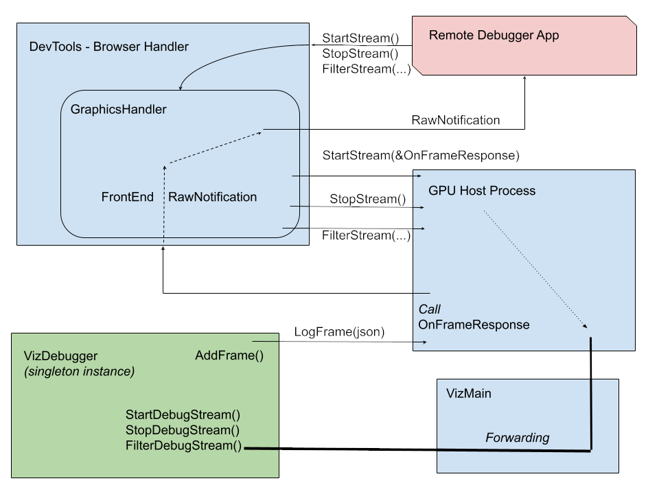

# //tools/visual_debugger/

## Chromium Visual Debugger App

The  Chromium Visual Debugger App is the viewer for the debug stream from a (remote) chromium instance.
For information on the chromium integration of debug capture see: `//components/viz/service/debugger/README.md`

### Launching
To use the Visual Debugger, Chromium must be launch with remote debugging support.

`$ ./chrome --remote-debugging-port=7777 --remote-allow-origins=*`

To launch the Debugging App simply run the python server from this directory. The default port is 7777.

`$ tools/visual_debugger/server.py [portnumber]`

This command will also launch the debugger as a Web App in a separate instance of the default browser.

In official builds (`is_official_build=true` gn arg) the debugger is disabled by default but can be force enabled locally with the flag below in **args.gn**.

`    use_viz_debugger=true`

#### Android

In order to connect to an Android device it must be launched with the args above
and connected via USB to your development machine. Android ADB can then be setup
to forward Chrome Devtools Protocol to the remote port, for example if you used
`--remote-debugging-port=7777` when launching Chrome you would run the
following.

`$ adb forward tcp:7777 localabstract:chrome_devtools_remote`

### Usage

Once the Debugging App launches one should be able to simply click **Connect** to establish a remote debugging stream to the live instance of chromium.

The in App filters `frame.root.quad` and `frame.root.damage` have been provided by default to give immediate feedback and intuition. The debug macros corresponding to these filters, and all others, can be found directly in the source.

[Default Filter Debug Macros](https://source.chromium.org/chromium/chromium/src/+/main:components/viz/service/display/display.cc;l=640;drc=5af781c328bdc091651764b5d9ea0f6d77828fed?q=display.cc&ss=chromium%2Fchromium%2Fsrc)

### Operation
The debugging macros feed information into the VizDebugger static instance. At the end of each frame this cached information is fed upstream and eventually reaches the remote client.

### Performance
The Debugger App preforms nominally in most basic debugging situations.
Excessive debug logging, specifically text, can  make the App feel sluggish.
It is recommended to delete unused filters and disable filters to improve App performance.

### Security

For official builds all visual debug macros end up as chrome traces. This means there are minimal security concerns for this system with exception of mutable side effects in the creation of input variables to the logging macros. These concerns for mutable side effects already exist for any other code; so no special attention is warranted for these macros.

For non-official (debug) builds the dev-tools remote debugging port command line argument must be provided for the viz debugger to collect and stream data. Thus the security of this new system is identical to that of the remote dev tools for the case of debugging builds.

### Visual debugger to trace (Prototype)

For official builds the visual debugger is disabled but the logging feeds into the chrome tracing system. This visual debugger specific tracing is reported with the 'viz.visual_debugger' tracing category. These traces can be imported into the visual debugger using the import trace button.

The overhead of these optional traces has been evaluated and the cost has been found to be acceptable.
[Trace Macro Overhead in Official Builds](https://docs.google.com/document/d/1oWtNgW0XXU5UCO_0mJlYwTLE0nMQIMJO6oIyKs15Ci8/)

